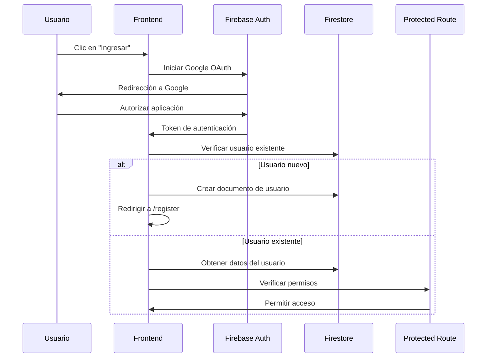
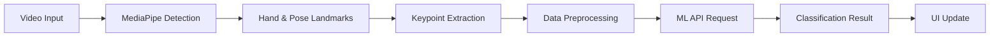

# Arquitectura del Sistema - ColSign

## 📋 Visión General

ColSign es una aplicación web moderna construida con Next.js 15 y Firebase, diseñada para facilitar la inclusión social de personas sordas en Colombia. El sistema utiliza una arquitectura de microservicios distribuidos con componentes de IA integrados.

## 🏗️ Arquitectura de Alto Nivel

```
┌─────────────────────────────────────────────────────────────┐
│                    Frontend (Next.js)                      │
├─────────────────────────────────────────────────────────────┤
│  ┌─────────────┐  ┌─────────────┐  ┌─────────────┐        │
│  │   Pages     │  │ Components  │  │    Hooks    │        │
│  │             │  │             │  │             │        │
│  └─────────────┘  └─────────────┘  └─────────────┘        │
├─────────────────────────────────────────────────────────────┤
│                    API Layer                                │
├─────────────────────────────────────────────────────────────┤
│  ┌─────────────┐  ┌─────────────┐  ┌─────────────┐        │
│  │  Firebase   │  │   MediaPipe │  │ TensorFlow  │        │
│  │   Services  │  │             │  │     .js     │        │
│  └─────────────┘  └─────────────┘  └─────────────┘        │
├─────────────────────────────────────────────────────────────┤
│                    External APIs                           │
│  ┌─────────────┐  ┌─────────────┐  ┌─────────────┐        │
│  │ ML Models   │  │ Google OAuth│  │ Analytics   │        │
│  │    API      │  │             │  │             │        │
│  └─────────────┘  └─────────────┘  └─────────────┘        │
└─────────────────────────────────────────────────────────────┘
```

## 🔧 Stack Tecnológico

### Frontend
- **Next.js 15.1.7**: Framework de React con App Router
- **React 19.0.0**: Biblioteca de UI
- **TypeScript 5**: Tipado estático
- **Tailwind CSS 3.4.1**: Framework de CSS utility-first
- **Heroicons**: Iconografía moderna

### Backend y Servicios
- **Firebase 11.6.1**: Plataforma backend como servicio
  - Authentication (Google OAuth)
  - Firestore (Base de datos NoSQL)
  - Storage (Almacenamiento de archivos)
  - Security Rules (Reglas de seguridad)

### IA y Machine Learning
- **MediaPipe**: Detección de poses y manos en tiempo real
- **TensorFlow.js 4.22.0**: Machine Learning en el navegador
- **@tensorflow-models/handpose**: Modelo de detección de manos
- **API de Modelos LSC**: Servicio propio para clasificación de señas colombianas

### Utilidades y Herramientas
- **Axios 1.7.9**: Cliente HTTP
- **Zod 3.24.1**: Validación de esquemas
- **UUID 11.1.0**: Generación de identificadores únicos
- **NextAuth 5.0.0-beta.25**: Autenticación adicional

## 📁 Estructura de Directorios

```
cap_data_sign/
├── app/                          # App Router de Next.js
│   ├── components/               # Componentes compartidos
│   │   ├── ProtectedRoute.tsx   # Protección de rutas
│   │   └── TermsAndConditionsModal.tsx
│   ├── information/              # Páginas de información
│   │   ├── contact-details/
│   │   ├── help/
│   │   ├── publications/
│   │   └── sponsors/
│   ├── login/                    # Autenticación
│   ├── profile/                  # Panel de usuario
│   │   ├── admin-contributions/  # Gestión de contribuciones
│   │   ├── admin-signs-data/     # Gestión de señas
│   │   ├── admin-users/          # Gestión de usuarios
│   │   ├── contributions/        # Contribuciones del usuario
│   │   ├── evaluate/             # Sistema de evaluación
│   │   ├── interpreter-lsc/      # Intérprete LSC
│   │   └── send-signs/           # Envío de señas
│   ├── register/                 # Registro de usuarios
│   ├── ui/                       # Componentes de UI
│   │   ├── admin-contributions/
│   │   ├── admin-signs-data/
│   │   ├── evaluate/
│   │   ├── interpreter-lsc/
│   │   ├── profile/
│   │   ├── send-signs/
│   │   └── shared/
│   └── unauthorized/             # Página de acceso denegado
├── firebase/                     # Configuración de Firebase
│   └── firebaseConfig.ts
├── hooks/                        # Custom hooks
│   ├── useAuth.ts
│   └── authUtils.ts
├── types/                        # Definiciones de tipos TypeScript
│   └── mediapipe-globals.d.ts
└── public/                       # Archivos estáticos
    ├── information-resources/
    └── customers/
```

## 🔐 Sistema de Autenticación

### Flujo de Autenticación


### Roles de Usuario
- **Rol 1 (Admin)**: Acceso completo, gestión de usuarios y contenido
- **Rol 2 (User)**: Funcionalidades básicas, envío de señas
- **Rol 3 (Evaluator)**: Módulos de evaluación y encuestas

## 🗄️ Modelo de Datos

### Colecciones de Firestore

#### users
```typescript
interface User {
  uid: string;
  email: string;
  firstName: string;
  lastName: string;
  roleId: number;        // 1=Admin, 2=User, 3=Evaluator
  levelId: number;       // 1=Experto, 2=Intermedio, 3=Novato
  createdAt: Timestamp;
  status_tyc: boolean;   // Términos y condiciones aceptados
}
```

#### sign_data
```typescript
interface SignData {
  id: string;
  id_user: string;
  label: string;
  type: string;          // 'Caracter', 'Palabra', 'Frases'
  nivel_user: number;
  videoPath: string;
  status_verified: boolean;
  createdAt: Timestamp;
}
```

#### video_example
```typescript
interface VideoExample {
  id: string;
  name: string;
  type: string;
  meaning: string;
  reference: string;
  videoPath: string;
  status: string;        // 'activo', 'inactivo'
  createdAt: Timestamp;
}
```

#### evaluates_sign
```typescript
interface EvaluateSign {
  id: string;
  label: string;
  recordedVideoDocId: string;
  url_video: string;
  signName: string;
  signId: string;
  signType: string;
  userId: string;
  userLevelId: number;
  type_extract: string;
  model: string;         // 'alphabet_1', 'words_v2'
  prediction: string;
  probabilities: number[];
  evaluatedAt: Timestamp;
}
```

#### user_opinions
```typescript
interface UserOpinion {
  id: string;
  userId: string;
  q1Rating: number;      // 1-5 rating
  q2Rating: number;      // 1-5 rating
  q3Rating: number;      // 1-5 rating
  q4Response: string;
  q5Opinion: string;
  createdAt: Timestamp;
}
```

## 🤖 Integración de IA

### Pipeline de Reconocimiento de Señas


### Componentes de IA
- **MediaPipe Hands**: Detección de 21 puntos de referencia de manos
- **MediaPipe Pose**: Detección de 33 puntos de referencia del cuerpo
- **TensorFlow.js**: Procesamiento de datos en el navegador
- **API de Modelos LSC**: Clasificación de señas con modelos entrenados específicamente para lengua de señas colombianas

## 🔄 Flujos de Datos Principales

### 1. Captura de Señas
```
Usuario → Cámara → MediaPipe → Keypoints → Firebase Storage → Firestore
```

### 2. Reconocimiento de Señas
```
Video → MediaPipe → Keypoints → API ML LSC → Clasificación → UI
```

### 3. Sistema de Evaluación
```
Usuario → Grabación → Procesamiento → API LSC → Resultado → Firestore
```

### 4. Panel de Administración
```
Admin → Firestore → Consultas → UI → Acciones → Firestore
```

## 🛡️ Seguridad

### Reglas de Firestore
- Autenticación requerida para todas las operaciones
- Usuarios solo pueden acceder a sus propios datos
- Admins tienen acceso completo
- Validación de roles en cada operación

### Reglas de Storage
- Autenticación requerida para subida de archivos
- Usuarios solo pueden acceder a sus archivos
- Admins pueden gestionar todos los archivos
- Validación de tipos de archivo

### Protección de Rutas
- Componente `ProtectedRoute` para rutas privadas
- Verificación de roles en tiempo real
- Redirección automática para usuarios no autorizados

## 📊 Performance y Optimización

### Estrategias de Rendimiento
- **Lazy Loading**: Carga diferida de componentes pesados
- **Image Optimization**: Optimización automática de imágenes con Next.js
- **Code Splitting**: División automática del código por rutas
- **Caching**: Caché de Firebase y Next.js

### Optimizaciones de IA
- **Web Workers**: Procesamiento de IA en hilos separados
- **Batch Processing**: Procesamiento por lotes de keypoints
- **Model Caching**: Caché de modelos de TensorFlow.js
- **Progressive Loading**: Carga progresiva de modelos

## 🔧 Configuración y Despliegue

### Entornos
- **Desarrollo**: `localhost:3000` con Firebase dev
- **Staging**: Vercel preview con Firebase staging
- **Producción**: Vercel production con Firebase production

### Variables de Entorno
- Configuración de Firebase
- Roles de aplicación
- URLs de APIs externas
- Configuraciones de desarrollo/producción

## 📈 Escalabilidad

### Estrategias de Escalado
- **Horizontal**: Múltiples instancias de Next.js
- **Vertical**: Optimización de recursos por instancia
- **Database**: Firestore escala automáticamente
- **Storage**: Firebase Storage con CDN global

### Monitoreo
- **Firebase Analytics**: Métricas de uso
- **Performance Monitoring**: Rendimiento de la aplicación
- **Crashlytics**: Monitoreo de errores
- **Custom Logging**: Logs personalizados

## 🔗 Integraciones Externas

### API de Modelos de Lengua de Señas Colombianas
- **Repositorio**: [GitHub: models-lsc-api](https://github.com/FerchoRV/models-lsc-api)
- **Tecnología**: Python + FastAPI + Docker
- **Funcionalidades**:
  - **Clasificación de Alfabeto**: Modelo para reconocer letras del alfabeto LSC
  - **Clasificación de Palabras**: Modelo para reconocer palabras en LSC
  - **Clasificación de Frases**: Modelo para reconocer frases completas
- **Integración**: API REST con endpoints específicos para cada tipo de reconocimiento
- **Configuración**: Variable de entorno `NEXT_PUBLIC_API_MODELS_URL`

### Servicios de Google
- **Google OAuth**: Autenticación
- **Google Analytics**: Métricas
- **Google Cloud Storage**: Almacenamiento

## 📝 Consideraciones Futuras

### Mejoras Planificadas
- **Real-time Collaboration**: Colaboración en tiempo real
- **Mobile App**: Aplicación móvil nativa
- **Advanced Analytics**: Análisis avanzado de datos
- **Multi-language Support**: Soporte multiidioma

### Arquitectura Evolutiva
- **Microservices**: Migración a microservicios
- **Event-driven**: Arquitectura basada en eventos
- **CQRS**: Separación de comandos y consultas
- **Event Sourcing**: Trazabilidad completa de eventos

---

**Nota**: Esta arquitectura está diseñada para ser escalable, mantenible y segura, permitiendo el crecimiento futuro del sistema.
